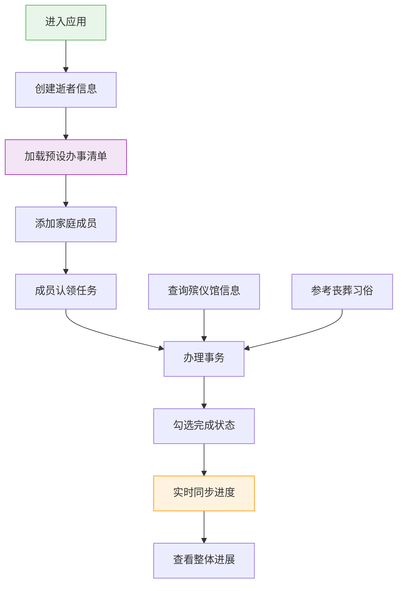

## 1. 产品概述

丧事白事事务清单与家庭协作工具，为失去亲人的家庭提供有序、温暖的事务办理指引与协作平台。通过预设标准化办事清单、家庭成员分工协作、进度实时同步、殡仪馆信息查询与丧葬习俗参考等功能，帮助家庭在悲痛中有条不紊地处理各项身后事宜。

## 2. 核心功能

### 2.1 用户角色
| 角色 | 登录方式 | 核心权限 |
|------|---------|---------|
| 家庭成员 | 昵称登录（模拟协作） | 创建清单、认领任务、标记进度、查看整体进展 |
| 访客 | 无需登录 | 浏览殡仪馆信息、丧葬习俗参考 |

### 2.2 功能模块
1. **首页仪表盘**：整体进度概览、快速入口、逝者信息卡片
2. **事务清单**：预设"身后事办理清单"模板、分类展示、勾选完成、进度追踪
3. **协作中心**：家庭成员管理、任务认领、分工展示、实时同步
4. **信息参考**：殡仪馆信息查询、各地丧葬习俗参考、办事指南

### 2.3 页面详情
| 页面名称 | 模块名称 | 功能描述 |
|---------|---------|----------|
| 首页仪表盘 | 进度总览 | 环形进度图展示整体办理进度、已完成/进行中/待办统计 |
| 首页仪表盘 | 逝者信息卡 | 展示逝者姓名、生卒日期、关系等基本信息 |
| 首页仪表盘 | 快速操作 | 新增成员、添加自定义任务、查看今日待办 |
| 事务清单页 | 分类清单 | 按政务事务、丧葬事务、财务事务、其他事务分类展示 |
| 事务清单页 | 任务卡片 | 任务名称、详情说明、办理期限、负责人、完成状态 |
| 事务清单页 | 任务操作 | 勾选完成、认领/转让、添加备注、设置优先级 |
| 协作中心页 | 成员列表 | 头像、姓名、角色、负责任务数、完成率 |
| 协作中心页 | 任务分配 | 可视化任务分配图、未分配任务列表 |
| 信息参考页 | 殡仪馆查询 | 按城市筛选、地址、电话、服务项目、评分 |
| 信息参考页 | 丧葬习俗 | 按地区分类、传统习俗流程、注意事项 |
| 信息参考页 | 办事指南 | 各项事务所需材料、办理地点、办理流程 |

## 3. 核心流程

用户首次进入应用，创建逝者信息档案 → 系统自动加载预设的"身后事办理清单"模板 → 邀请/添加家庭成员 → 成员认领各项事务 → 办理过程中实时勾选完成状态 → 所有协作者实时查看整体进展 → 遇到问题时查询殡仪馆信息和丧葬习俗参考。

## 4. 用户界面设计

### 4.1 设计风格
- **主色调**：深墨蓝色（#1a237e）—— 庄重、肃穆、尊重
- **辅助色**：暖金色（#ffc107）—— 温暖、希望、纪念
- **中性色**：石板灰（#37474f）、米白色（#fafafa）
- **按钮风格**：圆角矩形（8px）、扁平化设计、悬浮微动效
- **字体**：标题用"Noto Serif SC"（宋体风格，庄重典雅），正文用"Noto Sans SC"（简洁易读）
- **布局风格**：卡片式布局、充足留白、柔和阴影、层次分明
- **图标**：线性风格、简洁克制、避免花哨

### 4.2 页面设计概述
| 页面名称 | 模块名称 | UI元素 |
|---------|---------|--------|
| 首页仪表盘 | 进度总览 | 环形进度条、渐变色填充、数字动态计数、悬浮时展示详情 |
| 首页仪表盘 | 逝者信息卡 | 黑白照片占位、金色边框、生卒日期、安息文案 |
| 事务清单页 | 任务卡片 | 未完成：白色底+浅灰边；完成：浅绿底+对勾图标；进行中：金色边框+脉动动画 |
| 协作中心页 | 成员卡片 | 圆形头像、姓名、任务进度条、完成率徽章 |
| 信息参考页 | 信息卡片 | 分类标签、搜索框、列表/网格切换、展开详情动画 |

### 4.3 响应式设计
- **桌面端优先**：三栏布局（侧边导航+主内容+辅助面板）
- **平板端**：两栏布局（侧边导航折叠为图标+主内容）
- **移动端**：单栏布局（底部标签导航+垂直滚动内容）
- **触摸优化**：按钮最小尺寸44x44px、卡片点击区域扩大、滑动手势支持

## 5. 数据与交互说明

### 5.1 预设任务清单模板
1. **政务事务类**：
   - 开具死亡证明（医院/派出所）
   - 注销户口（派出所）
   - 停办医保社保（社保中心）
   - 注销身份证（派出所）
   - 办理丧葬费/抚恤金（社保中心）

2. **丧葬事务类**：
   - 联系殡仪馆（电话咨询、预约服务）
   - 预约火化时间（确认日期、时间段）
   - 安排告别仪式（厅室选择、流程设计）
   - 选购骨灰盒/寿衣（款式、材质）
   - 选购墓地/骨灰堂（位置、价格、手续）
   - 准备遗像/挽联/花圈
   - 通知亲友（发送讣告）
   - 安排接送车辆

3. **财务事务类**：
   - 注销银行账户（各银行网点）
   - 处理房产过户（不动产登记中心）
   - 办理车辆过户（车管所）
   - 处理股票/基金/保险（证券公司、保险公司）
   - 结清水电燃气物业费用
   - 注销手机号/宽带

4. **其他事务类**：
   - 处理社交账号/邮箱
   - 归还借阅物品
   - 处理宠物安置
   - 感谢答谢亲友
   - 整理遗物

### 5.2 交互细节
- 任务勾选：点击复选框时有圆形波纹扩散动画，延迟0.3秒后显示完成状态
- 进度更新：数字采用滚动计数动画，环形进度条采用SVG渐变描边动画
- 成员认领：弹出模态框，选择成员后有分配成功的轻提示
- 页面切换：采用淡入淡出+轻微上移的过渡动画，时长300ms
