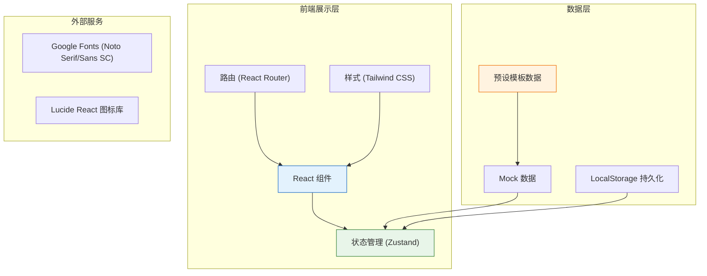
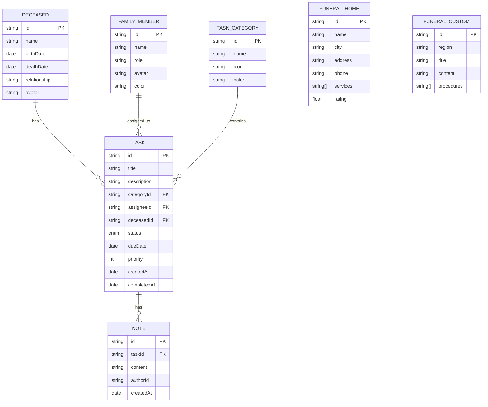

## 1. 架构设计



## 2. 技术选型说明

| 技术栈 | 版本 | 用途 | 选型理由 |
|--------|------|------|---------|
| React | 18.x | 前端框架 | 组件化开发，生态成熟，适合单页应用 |
| TypeScript | 5.x | 类型系统 | 类型安全，提升代码可维护性 |
| Vite | 5.x | 构建工具 | 开发速度快，热更新效率高 |
| Tailwind CSS | 3.x | 样式框架 | 原子化CSS，快速构建UI，响应式友好 |
| Zustand | 4.x | 状态管理 | 轻量级，API简洁，适合中小型应用 |
| React Router DOM | 6.x | 路由管理 | 官方推荐路由库，支持嵌套路由和动态路由 |
| Lucide React | 0.344.x | 图标库 | 线性风格，简洁美观，符合设计要求 |

## 3. 目录结构

```
src/
├── components/          # 可复用组件
│   ├── layout/         # 布局组件
│   │   ├── Sidebar.tsx
│   │   ├── Header.tsx
│   │   └── MobileNav.tsx
│   ├── tasks/          # 任务相关组件
│   │   ├── TaskCard.tsx
│   │   ├── TaskCategory.tsx
│   │   └── TaskProgress.tsx
│   ├── members/        # 成员相关组件
│   │   ├── MemberCard.tsx
│   │   ├── MemberAvatar.tsx
│   │   └── AssignTaskModal.tsx
│   └── common/         # 通用组件
│       ├── ProgressRing.tsx
│       ├── Button.tsx
│       ├── Card.tsx
│       └── Modal.tsx
├── pages/              # 页面组件
│   ├── Dashboard.tsx
│   ├── TaskList.tsx
│   ├── Collaboration.tsx
│   └── Reference.tsx
├── store/              # 状态管理
│   └── useStore.ts
├── types/              # 类型定义
│   └── index.ts
├── data/               # Mock数据与模板
│   ├── taskTemplate.ts
│   ├── funeralHomes.ts
│   └── customs.ts
├── utils/              # 工具函数
│   ├── storage.ts
│   ├── dateUtils.ts
│   └── progressUtils.ts
├── App.tsx
├── main.tsx
└── index.css
```

## 4. 路由定义

| 路由路径 | 页面组件 | 页面说明 |
|---------|---------|---------|
| `/` | Dashboard | 首页仪表盘，整体进度概览 |
| `/tasks` | TaskList | 事务清单页，分类展示所有任务 |
| `/collaboration` | Collaboration | 协作中心页，成员管理和任务分配 |
| `/reference` | Reference | 信息参考页，殡仪馆和习俗查询 |

## 5. 数据模型定义

### 5.1 ER图



### 5.2 TypeScript 类型定义

```typescript
export interface Deceased {
  id: string;
  name: string;
  birthDate: string;
  deathDate: string;
  relationship: string;
  avatar?: string;
}

export interface FamilyMember {
  id: string;
  name: string;
  role: string;
  avatar?: string;
  color: string;
}

export interface TaskCategory {
  id: string;
  name: string;
  icon: string;
  color: string;
}

export type TaskStatus = 'pending' | 'in-progress' | 'completed';

export interface Task {
  id: string;
  title: string;
  description: string;
  categoryId: string;
  assigneeId?: string;
  deceasedId: string;
  status: TaskStatus;
  dueDate?: string;
  priority: 1 | 2 | 3;
  createdAt: string;
  completedAt?: string;
  notes?: Note[];
}

export interface Note {
  id: string;
  taskId: string;
  content: string;
  authorId: string;
  createdAt: string;
}

export interface FuneralHome {
  id: string;
  name: string;
  city: string;
  address: string;
  phone: string;
  services: string[];
  rating: number;
}

export interface FuneralCustom {
  id: string;
  region: string;
  title: string;
  content: string;
  procedures: string[];
}

export interface AppState {
  deceased: Deceased | null;
  members: FamilyMember[];
  tasks: Task[];
  categories: TaskCategory[];
  currentUser: FamilyMember | null;
}
```

## 6. 状态管理设计

使用 Zustand 管理全局状态，主要包含：

```typescript
interface Store {
  // 状态
  deceased: Deceased | null;
  members: FamilyMember[];
  tasks: Task[];
  categories: TaskCategory[];
  currentUser: FamilyMember | null;
  
  // 逝者操作
  setDeceased: (deceased: Deceased) => void;
  
  // 成员操作
  addMember: (member: FamilyMember) => void;
  removeMember: (id: string) => void;
  setCurrentUser: (member: FamilyMember) => void;
  
  // 任务操作
  addTask: (task: Omit<Task, 'id' | 'createdAt'>) => void;
  updateTask: (id: string, updates: Partial<Task>) => void;
  deleteTask: (id: string) => void;
  assignTask: (taskId: string, memberId: string) => void;
  toggleTaskStatus: (taskId: string) => void;
  
  // 初始化
  initializeFromTemplate: (deceased: Deceased) => void;
}
```

## 7. 预设数据模板

### 7.1 任务分类

| 分类ID | 分类名称 | 图标 | 颜色 |
|--------|---------|------|------|
| gov | 政务事务 | Building2 | #1976d2 |
| funeral | 丧葬事务 | HeartHandshake | #c62828 |
| finance | 财务事务 | Wallet | #2e7d32 |
| other | 其他事务 | MoreHorizontal | #6a1b9a |

### 7.2 殡仪馆数据（部分示例）

| 城市 | 殡仪馆名称 | 地址 | 电话 |
|------|-----------|------|------|
| 北京 | 八宝山殡仪馆 | 北京市石景山区石景山路9号 | 010-88255555 |
| 上海 | 龙华殡仪馆 | 上海市徐汇区漕溪路210号 | 021-64382484 |
| 广州 | 广州市殡仪馆 | 广州市天河区燕岭路418号 | 020-87741111 |
| 深圳 | 深圳市殡仪馆 | 深圳市龙岗区龙岗大道3031号 | 0755-28755555 |

### 7.3 丧葬习俗（部分示例）

| 地区 | 习俗特点 |
|------|---------|
| 北京 | 三天出殡、停灵办事、烧七习俗 |
| 上海 | 素色着装、追悼会仪式、骨灰寄存 |
| 广东 | 做七习俗、风水讲究、宗族仪式 |
| 四川 | 喜丧文化、打丧鼓、宴客答谢 |
